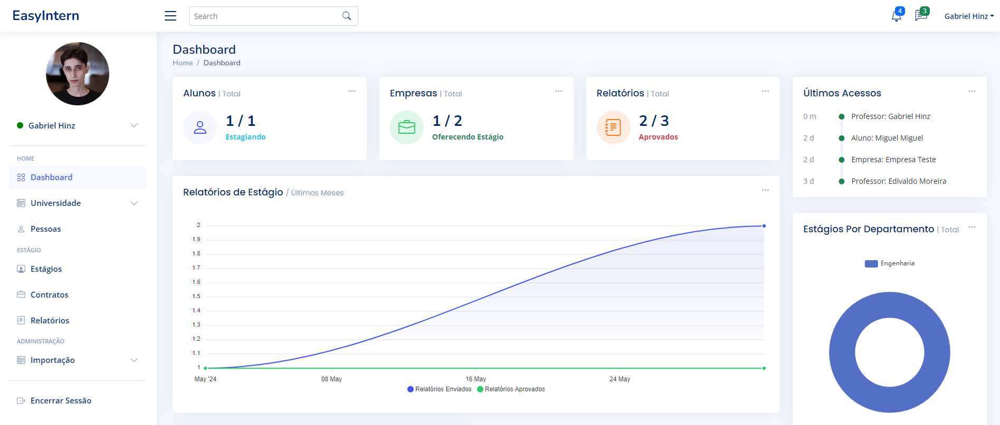
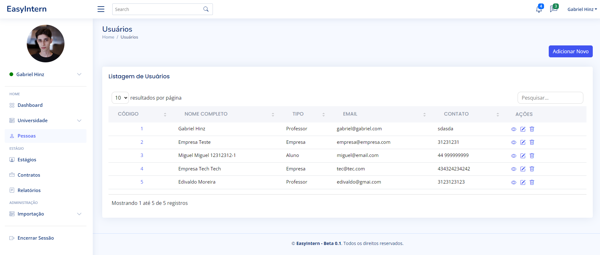
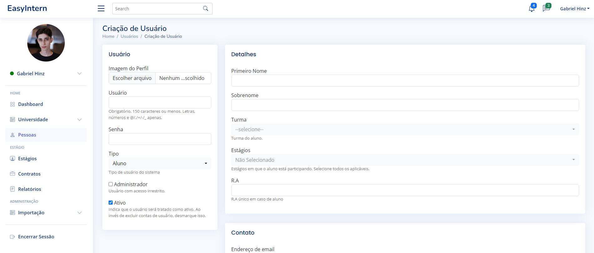

# EASYINTERN - Sistema de Gestão de Estágios Obrigatórios

O Sistema de Gestão de Estágios Obrigatórios `EASYINTERN` foi desenvolvido com o objetivo de facilitar e organizar o gerenciamento completo dos estágios obrigatórios no contexto acadêmico.

A plataforma permite que alunos, professores e empresas interajam de forma integrada, proporcionando um controle eficiente desde a criação até a conclusão dos estágios, através de relatórios dos alunos, assinaturas por parte dos professores e emrpesas e também controle de contrato de estágio.

## Configuração e Setup

Garanta no seu sistema que esteja instalado:
- Docker e docker-composer

Para configurar o sistema, siga as etapas abaixo:

1. Certifique-se de ter o Docker e o Docker Compose instalados em sua máquina.
2. Navegue até o diretório raiz do projeto.


3. Configure o arquivo .env com os dados como secret e host caso for utilizar um customizado

```shell
# Boolean (True ou False) Obs: Em produção o DEBUG deve estar desabilitado
DEBUG=True
# Separe os HOSTS com espaço
ALLOWED_HOSTS=localhost
# Chave secreta da aplicação (Deve ser alterada)
SECRET_KEY="minha-chave-secreta-easyintern"
```

4. Execute o seguinte comando para iniciar os contêineres:

```shell
docker-compose up -d --build
```

5. Configure um usuário administrador para acessar e começar a configurar a aplicação

```shell
docker-compose exec easyintern python manage.py createsuperuser
```
- Siga as instruções fornecidas para criar o usuário administrador.

Após a configuração, você pode acessar o sistema por meio do navegador usando o seguinte URL: `http://localhost:8000`.


## Manuseando docker-compose

1. Buildar novamente
```shell
docker-compose up -d --build
```

2. Desligar aplicação (Pós build e em execução)
```shell
docker-compose down
```

3. Ligar aplicação (Pós build)
```shell
docker-compose up -d
```

## Alterando portas de comunicação

Para alterar as portas utilizadas pelo sistema, siga as etapas abaixo:

1. Abra o arquivo `docker-compose.yml` no diretório raiz do projeto.
2. Procure pela seção `ports` dentro do serviço `easyintern`.
3. Modifique as portas conforme necessário, seguindo o formato `porta_host:8000`.
4. Salve as alterações no arquivo.

Após realizar essas alterações, execute o comando `docker-compose up -d --build` para reiniciar os contêineres com as novas configurações de portas.

## Screenshots






## Contribuição
Para contribuir para este projeto realize um fork e crie um pull-request das suas alterações, ele será validado e implementado se fizer sentido ao sistema.

## Licença
Este projeto é licenciado sob a Licença MIT. Veja o arquivo LICENSE para mais detalhes.